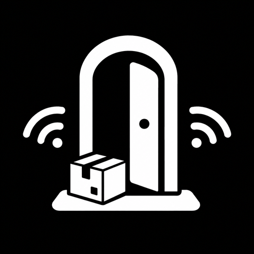

<div align="center">



# Doorstep

**Your phone is another folder on your computer.**

Free and open-source file sharing between your own devices over your own network.
No internet, no cloud, no accounts.

[![CI][ci-badge]][ci-workflow]
[![Release][release-badge]][releases]
[![Platforms][platform-badge]][platforms]
[![License][license-badge]][license]
[![PRs welcome][prs-badge]][prs]

[Download](#download) · [How it works](#how-it-works) · [Build from source](#build-from-source) · [Contributing](CONTRIBUTING.md)

[ci-badge]: https://img.shields.io/github/actions/workflow/status/javex-12/Doorstep/ci.yml?branch=main&label=CI&style=flat-square
[ci-workflow]: https://github.com/javex-12/Doorstep/actions/workflows/ci.yml
[release-badge]: https://img.shields.io/github/v/release/javex-12/Doorstep?include_prereleases&label=release&style=flat-square
[releases]: https://github.com/javex-12/Doorstep/releases
[platform-badge]: https://img.shields.io/badge/platform-Android%20%7C%20Windows%20%7C%20Linux%20%7C%20macOS%20%7C%20iOS-lightgrey?style=flat-square
[platforms]: #download
[license-badge]: https://img.shields.io/badge/license-Apache--2.0-blue?style=flat-square
[license]: LICENSE
[prs-badge]: https://img.shields.io/badge/PRs-welcome-brightgreen?style=flat-square
[prs]: CONTRIBUTING.md

</div>

---

Pair once. After that Doorstep stays out of the way: drop a file into a folder on your computer and it arrives on your phone — **even with the app closed**. Share from your phone and it lands on your computer just as easily.

## Why Doorstep

Other file-sharing apps make you repeat the same dance every time: open the app, wait for discovery, pick the device, pick the files, send. Doorstep removes the dance.

| | Others | Doorstep |
|---|---|---|
| Pairing | Scan, re-scan, re-discover | **Once.** Devices reconnect on their own |
| Sending | Open app → wait → pick → send | Drop into a folder. Done |
| Receiving | App must be open | **Arrives with the app closed** |
| Internet | Sometimes required | **Never.** Everything stays on your network |
| Trust | Usually none | You approve every new device |

## Features

- **Pair once** — connect to a device and choose *personal* (remembered, reconnects automatically) or *temporary* (this session only). No QR codes.
- **Accept or decline** — anyone nearby can ask to connect; only you decide who gets in.
- **Drop zones** — mark folders on your computer. Anything dropped in is delivered automatically.
- **Receive with the app closed** — a battery-aware background service keeps your phone ready, with a notification you control.
- **Per-device routing** — point each drop zone at specific devices instead of everyone.
- **Live folder browser** — browse folders on your computer from your phone and pull files over.
- **Send a note** — type or paste text and send it straight over.
- **Clipboard sync** *(opt-in)* — copy on one device, paste on another.
- **Encrypted** — transfers run over authenticated TLS with per-device certificates. Only devices you approved can talk to you.
- **Private** — nothing is uploaded, ever. There is no server to upload to.

## Download

Grab a build from [Releases][releases] or from the [download page](https://javex-12.github.io/Doorstep/), which detects your platform automatically.

| Platform | Download | Notes |
|---|---|---|
| **Android** | `Doorstep-<version>-universal.apk` | One APK for every phone (arm64, armv7, x86_64) |
| **Windows** | `Doorstep-<version>-Setup.exe` | Installer; a portable `.zip` is also available |
| **Linux** | `Doorstep-<version>-linux-x86_64.AppImage` | x86_64 |
| **macOS** | `Doorstep-<version>-macos-universal.zip` | Universal binary |
| **iOS** | `Doorstep-<version>-iOS-unsigned.ipa` | Unsigned — requires sideloading |

> **Android note:** because Doorstep is distributed directly, Android shows a one-time "unknown apps" warning and Play Protect may ask for confirmation. That is normal for open-source apps installed outside the Play Store — the APK is built straight from this repository's source by GitHub Actions. See [FEATURES.md](FEATURES.md) for what each platform can and cannot do (iPhone included).

## How it works

1. Install Doorstep on both devices, on the same Wi-Fi.
2. Doorstep finds the other device automatically — tap **Connect**, and the other side accepts or declines.
3. Done. Files now move by themselves: drop zones on the computer, the share sheet on the phone.

Under the hood Doorstep speaks the [LocalSend protocol](https://github.com/localsend/protocol) (v2.1) over HTTPS with mandatory certificate verification, and discovers devices with UDP multicast and broadcast. It is built on a fork of [LocalSend](https://github.com/localsend/localsend)'s networking core (Apache-2.0) — sincere thanks to the LocalSend team; see [LICENSE](LICENSE) and in-app **Settings → About → Licence notices**.

Deeper detail lives in the docs:

| Doc | What it covers |
|---|---|
| [Architecture](docs/ARCHITECTURE.md) | How the repo fits together, isolates, Rust core |
| [Networking](docs/NETWORKING.md) | Protocol, encryption, the platform reality |
| [Discovery](docs/DISCOVERY.md) | How devices find each other, and the fallbacks |
| [Transfer flow](docs/TRANSFER-FLOW.md) | What happens between "tap send" and "file saved" |
| [Feature status](FEATURES.md) | What is real, what is planned, iOS specifics |
| [Roadmap](ROADMAP.md) | What ships next, and why |
| [Product spec](DOORSTEP.md) | The original product thinking |

## Build from source

The repo is a Flutter app on top of a Rust core:

| Path | What it is |
|---|---|
| `app/` | Flutter app (`doorstep_app`) — UI, providers, persistence, platform channels |
| `packages/doorstep_isolates/` | Dart isolate layer + Flutter-Rust-Bridge bindings (`rust_lib_doorstep`) |
| `packages/core/` | Rust crate `doorstep_core` — protocol, HTTP server/client, crypto, WebRTC |
| `packages/typed_isolates/` | Typed Dart isolate channels |
| `server/` | WebSocket signalling server for WebRTC (deployed separately) |
| `cli/` | `doorstep-cli` — terminal client on top of the core |

### Prerequisites

- Flutter `3.41.9`, pinned in [.fvmrc](.fvmrc) — use `fvm flutter` / `fvm dart`
- Rust toolchain (stable)
- Windows builds: Visual Studio with the C++ desktop workload

### Run

```bash
cd app
fvm flutter pub get
fvm dart run build_runner build   # dart_mappable, freezed, flutter_gen, mockito
fvm dart run slang                # i18n codegen
fvm flutter run
```

The Rust plugin builds automatically through cargokit during `flutter run` / `flutter build`.

### Checks (what CI runs)

```bash
cd app
fvm dart format --set-exit-if-changed lib test
fvm flutter analyze
fvm flutter test

cargo test --features full      # in packages/core — the --features part is required
cargo check                     # in packages/doorstep_isolates/rust, server, cli
```

Every release binary is built by [GitHub Actions](.github/workflows/build_all.yml) from a clean checkout, so the artifacts always match the source at that tag.

## Contributing

Contributions are welcome — see [CONTRIBUTING.md](CONTRIBUTING.md) for setup, conventions and good first issues. Translations, documentation and bug reports are as valuable as code.

If you find a security issue, please follow [SECURITY.md](SECURITY.md) rather than opening a public issue.

## Licence

[Apache-2.0](LICENSE). Doorstep is a fork of [LocalSend](https://github.com/localsend/localsend) — all credit and thanks to its authors for the protocol and networking core.

<div align="center">

Built by [cydercoder](https://cydercoder.vercel.app) ([@javex-12](https://github.com/javex-12))

</div>
