# Doorstep

[![CI status][ci-badge]][ci-workflow]

[ci-badge]: https://github.com/javex-12/Doorstep/actions/workflows/ci.yml/badge.svg
[ci-workflow]: https://github.com/javex-12/Doorstep/actions/workflows/ci.yml

[GitHub][github] • [Product Spec](DOORSTEP.md) • by [cydercoder](https://cydercoder.vercel.app)

[English (Default)](README.md) • [Español](/support/readme/README_ES.md) • [فارسی](/support/readme/README_FA.md) • [Filipino](/support/readme/README_PH.md) • [Français](/support/readme/README_FR.md) • [Indonesia](/support/readme/README_ID.md) • [Italiano](/support/readme/README_IT.md) • [日本語](/support/readme/README_JA.md) • [ភាសាខ្មែរ](/support/readme/README_KM.md) • [한국어](/support/readme/README_KO.md) • [Polski](/support/readme/README_PL.md) • [Português Brasil](/support/readme/README_PT_BR.md) • [Русский](/support/readme/README_RU.md) • [ภาษาไทย](/support/readme/README_TH.md) • [Türkçe](/support/readme/README_TR.md) • [Українська](/support/readme/README_UK.md) • [Tiếng Việt](/support/readme/README_VI.md) • [中文](/support/readme/README_ZH.md)

[github]: https://github.com/javex-12/Doorstep

Doorstep is a free, open-source app that allows you to securely share files and messages with nearby devices over your local network without needing an internet connection.

- [About](#about)
- [Screenshots](#screenshots)
- [Download](#download)
- [How It Works](#how-it-works)
- [Dependency Hierarchy](#dependency-hierarchy)
- [Getting Started](#getting-started)
- [Contributing](#contributing)
  - [Translation](#translation)
  - [Bug Fixes and Improvements](#bug-fixes-and-improvements)
- [Troubleshooting](#troubleshooting)
- [Building](#building)
  - [Android](#android)
  - [iOS](#ios)
  - [macOS](#macos)
  - [Windows](#windows)
  - [Linux](#linux)

## About

Doorstep is a cross-platform app that enables secure communication between devices using a REST API and HTTPS encryption. Unlike other messaging apps that rely on external servers, Doorstep doesn't require an internet connection or third-party servers, making it a fast and reliable solution for local communication.

## Screenshots


## Download

Grab the latest build for your platform from the [Releases page][latest] — every release ships ready-to-run installers and packages. No account, no cloud, no auto-update needed: just download and go.

| Windows                        | Android                | macOS            | Linux            | iOS             |
|--------------------------------|------------------------|------------------|------------------|-----------------|
| [EXE Installer][latest]        | [APK (64-bit)][latest] | [DMG Installer][latest] | [AppImage][latest] | (coming soon)   |
| [Portable ZIP][latest]         | [APK (32-bit)][latest] |                  | [TAR][latest]    |                 |
|                                |                        |                  | [DEB][latest]    |                 |

> App stores (Play Store, App Store, Microsoft Store) and package managers are coming soon.

[latest]: https://github.com/javex-12/Doorstep/releases/latest
[distribution channels]: https://github.com/javex-12/Doorstep/blob/main/CONTRIBUTING.md#distribution
[latest]: https://github.com/javex-12/Doorstep/releases/latest
[distribution channels]: https://github.com/javex-12/Doorstep/blob/main/CONTRIBUTING.md#distribution

**Compatibility**

| Platform | Minimum Version | Note                                                                                                                        |
|----------|-----------------|-----------------------------------------------------------------------------------------------------------------------------|
| Android  | 5.0             | -                                                                                                                           |
| iOS      | 12.0            | -                                                                                                                           |
| macOS    | 11 Big Sur      | Use OpenCore Legacy Patcher 2.0.2 |
| Windows  | 10              | The last version to support Windows 7 is v1.15.4. There might be backports of newer versions for Windows 7 in the future.   |
| Linux    | N.A.            | Deps: Gnome: `xdg-desktop-portal` and `xdg-desktop-portal-gtk`, KDE: `xdg-desktop-portal` and `xdg-desktop-portal-kde`      |

## Setup

In most cases, Doorstep should work out of the box. However, if you are having trouble sending or receiving files, you may need to configure your firewall to allow Doorstep to communicate over your local network.

| Traffic Type | Protocol | Port  | Action |
|--------------|----------|-------|--------|
| Incoming     | TCP, UDP | 53317 | Allow  |
| Outgoing     | TCP, UDP | Any   | Allow  |

Also make sure to disable AP isolation on your router. It should be usually disabled by default but some routers may have it enabled (especially guest networks).
See [troubleshooting](#troubleshooting) for more information.

**Portable Mode**

(Introduced in v1.13.0)

Create a file named `settings.json` located in the same directory as the executable.
This file can be empty.
The app will use this file to store settings instead of the default location.

**Start hidden**

(Updated in v1.15.0)

To start the app hidden (only in tray), use the `--hidden` flag (example: `doorstep.exe --hidden`).

> **Note:** the release binaries are named `doorstep` for compatibility with the LocalSend protocol tooling the fork builds on; the app itself is **Doorstep**.

On v1.14.0 and earlier, the app starts hidden if `autostart` flag is set, and the hidden setting is enabled.

## How It Works

Doorstep uses a secure communication protocol that allows devices to communicate with each other using a REST API. All data is sent securely over HTTPS, and the TLS/SSL certificate is generated on the fly on each device, ensuring maximum security.

For more information on the Doorstep Protocol, see the [documentation](https://github.com/localsend/protocol).

## Dependency Hierarchy



## Getting Started

To compile Doorstep from the source code, follow these steps:

1. Install Flutter [directly](https://flutter.dev) or using [fvm](https://fvm.app) (see [version required](.fvmrc))
2. Install [Rust](https://www.rust-lang.org/tools/install)
3. Clone the `Doorstep` repository
4. Run `cd app` to enter the app directory
5. Run `flutter pub get` to download dependencies
6. Run `flutter run` to start the app

> [!NOTE]
> Doorstep currently requires an older Flutter version (specified in [.fvmrc](.fvmrc))
> and thus build issues may be caused by a mismatch between the required and the (system-wide) installed Flutter version.  
> To make development more consistent, Doorstep uses [fvm](https://fvm.app) to manage the project Flutter version.
> After installing `fvm`, run `fvm flutter` instead of `flutter`.

## Contributing

We welcome contributions from anyone interested in helping improve Doorstep. If you'd like to contribute, there are a few ways to get involved:

### Translation

You can help translate Doorstep into other languages.

Alternatively, you can also contribute by forking this repository and adding translations manually.

The translations are located in the [app/assets/i18n](https://github.com/javex-12/Doorstep/tree/main/app/assets/i18n) directory. Edit the `_missing_translations_<locale>.json` or `strings_<locale>.i18n.json` file to add or update translations.


**_Take note:_ Fields decorated with `@` are not meant to be translated; they are not used in the app in any way, being merely informative text about the file or to give context to the translator.**

### Bug Fixes and Improvements

- **Bug Fixes:** If you find a bug, please create a pull request with a clear description of the issue and how to fix it.
- **Improvements:** Have an idea for how to improve Doorstep? Please create an issue first to discuss why the improvement is needed.

For more information, see the [contributing guide](https://github.com/javex-12/Doorstep/blob/main/CONTRIBUTING.md).

## Troubleshooting

| Issue              | Platform (Sending) | Platform (Receiving) | Solution                                                                                                                                |
|--------------------|--------------------|----------------------|-----------------------------------------------------------------------------------------------------------------------------------------|
| Device not visible | Any                | Any                  | Make sure to disable AP-Isolation on your router. If it is enabled, connections between devices are forbidden.                          |
| Device not visible | Any                | Windows              | Make sure to configure your network as a "private" network. Windows might be more restrictive when the network is configured as public. |
| Device not visible | macOS, iOS         | Any                  | You can try to toggle the "Local Network" permission under "Privacy" in the OS settings.                                                |
| Speed too slow     | Any                | Any                  | Use 5 Ghz; Disable encryption on both devices                                                                                           |
| Speed too slow     | Any                | Android              | Known issue. https://github.com/flutter-cavalry/saf_stream/issues/4                                                                     |

## Building

These commands are intended for maintainers only. Make sure to run them from the `app` directory.

### Android

Traditional APK

```bash
flutter build apk
```

AppBundle for Google Play

```bash
flutter build appbundle
```

### iOS

```bash
flutter build ipa
```

### macOS

```bash
flutter build macos
```

### Windows

**Traditional**

```bash
flutter build windows
```

**Local MSIX App**

```bash
flutter pub run msix:create
```

**Store ready**

```bash
flutter pub run msix:create --store
```

### Linux

**Traditional**

```bash
flutter build linux
```

**AppImage**

```bash
appimage-builder --recipe AppImageBuilder.yml
```

**Snap**

Snap packaging is not yet published for Doorstep — you can still build the binary locally (see below).

## Contributors

<a href="https://github.com/javex-12/Doorstep/graphs/contributors">
  
</a>
